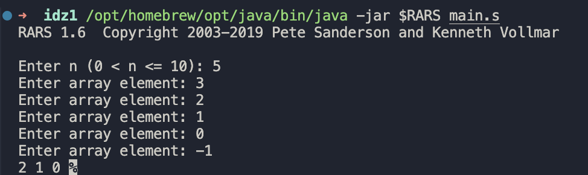
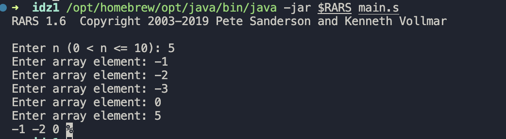
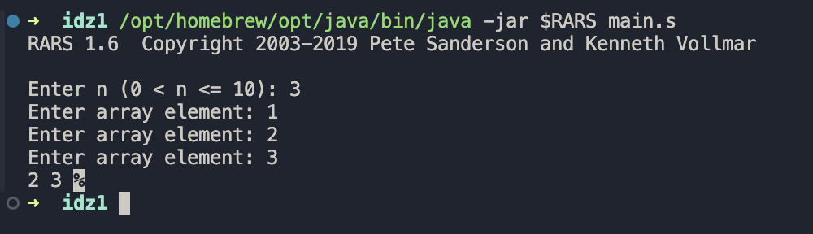
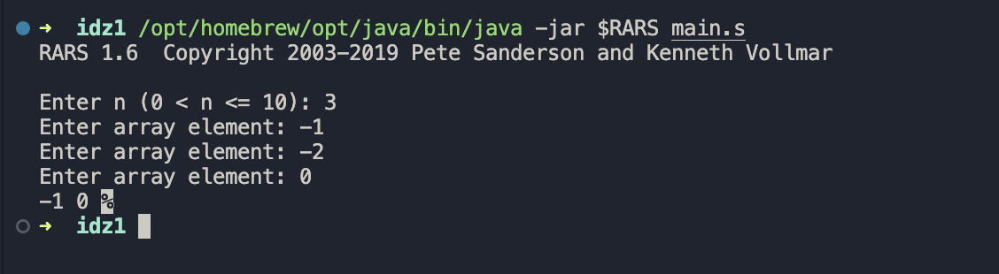
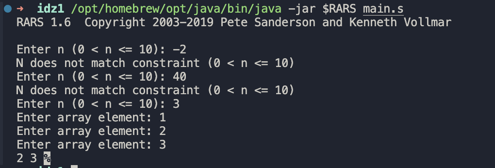

# АВС ИДЗ-1 Вар 12 Печенев Платон

Разработать программу, которая вводит одномерный массив A, состоящий из N элементов (значение N вводится при выполненпии программы),после чего формирует из элементов массива A новый массив B по правилам, указанным в варианте, и выводит его. Память под массивы может выделяться статически, на стеке, автоматичеси по выбору разработчика с учетом требований к оценке работы.

При решении задачи необходимо использовать подпрограммы для реализации ввода, вывода и формирования нового массива массива. Допустимы (при необходимости) дополнительные подпрограммы.

Максимальное количество элементов в массиве не должно превышать 10 (ограничение обуславливается вводом данных с клавиатуры). При этом необходимо обрабатывать некорректные значения как для нижней, так и для верхней границ массивов в зависимости от условия задачи.

> 12\. Сформировать массив B из элементов массива A, исключив первый положительный и последний отрицательный элементы.

---

## Тесты

### Стандартные случаи

### Без отрицательных

### Без положительных

### Корректность N

